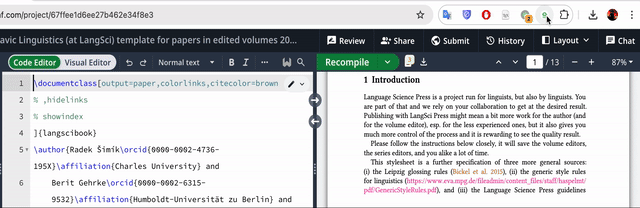

# Overleaf Compact Layout Chrome Extension

Maximizing your Overleaf editing space by hiding toolbars and providing quick actions.

<!-- 插入图片 -->


## Features

- **Toggle Compact Mode:** Hide toolbars to maximize your editing space
- **Quick Recompile:** Recompile your LaTeX document with one click from the extension popup
- **Clean Interface:** Unobtrusive design that integrates well with Overleaf's aesthetic

## Installation

### Option 1: Install from GitHub

1. **Download the extension**
   - Clone this repository or download it as a ZIP file
   - If downloaded as ZIP, extract the contents to a folder

   ```bash
   git clone https://github.com/HViktorTsoi/overleaf_compact_ext.git
   ```

2. **Load the extension in Chrome**
   - Open Chrome and navigate to `chrome://extensions/` or enter **"Manage Extensions"** in the address bar
   - Enable **"Developer mode"** by toggling the switch in the top-right corner
   - Click **"Load unpacked"** and select the extension folder
   - Refresh your overleaf page

3. **Verify installation**
   - The Overleaf Compact Layout icon should appear in your Chrome toolbar
   - You can pin it for easier access by clicking the Extensions icon and then the pin icon next to our extension

### Option 2: Install from Chrome Web Store

*Coming soon!*

## Usage

### Basic Usage

1. Navigate to any Overleaf project
2. Click the Overleaf Compact Layout extension icon in your toolbar
3. Use the `toggle switch` to enable or disable Compact Mode
4. Use the `Recompile` button to quickly recompile your document

<!-- [Usage Demo](screenshots/usage-demo.png) -->

### Extension Controls

| Control | Description |
|---------|-------------|
| **Compact Mode Toggle** | Switches between normal and compact layout. When enabled, toolbars are hidden to maximize editing space. |
| **Recompile Button** | Triggers a recompilation of your document without needing to find the recompile button in the Overleaf interface. |


## How It Works

The extension works by:

1. Applying CSS to hide unnecessary UI elements when compact mode is enabled
2. Using a MutationObserver to ensure compact mode stays enabled even when Overleaf updates its DOM
3. Simulating button clicks to trigger Overleaf's native recompile functionality

## Troubleshooting

| Issue | Solution |
|-------|----------|
| **Extension not working** | Make sure you're on an Overleaf project page. Refresh the page and try again. |
| **Compact mode toggling doesn't work** | Try disabling and re-enabling the extension, or refresh the Overleaf page. |
| **Recompile button doesn't work** | Ensure you're on an Overleaf project page with an editor open. The recompile button may not appear in some Overleaf views. |

## Future Features

<!-- - Theme customization options -->
- Customizable keyboard shortcuts
- Additional quick actions

<!-- ## Contributing

Contributions are welcome! Please feel free to submit a Pull Request.

1. Fork the repository
2. Create your feature branch (`git checkout -b feature/amazing-feature`)
3. Commit your changes (`git commit -m 'Add some amazing feature'`)
4. Push to the branch (`git push origin feature/amazing-feature`)
5. Open a Pull Request -->

## License

This project is licensed under the MIT License - see the LICENSE file for details.

<!-- ## Acknowledgments

- Thanks to Overleaf for creating an excellent LaTeX editing platform
- Icon designed with inspiration from Overleaf's brand identity

--- -->

*This extension is not affiliated with or endorsed by Overleaf.*